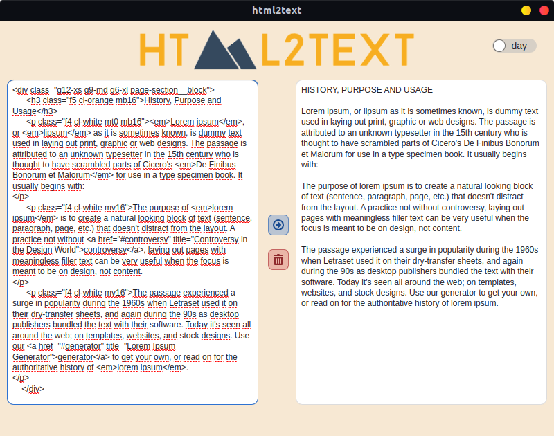
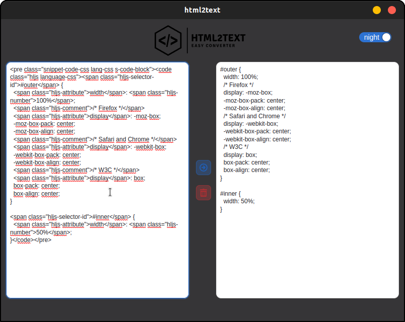

> [!NOTE]  
> This simple application was created for the sole purpose of learning how to integrate different themes and create
> packages for different distributions.

# html2text

Welcome to html2text, your go-to tool for effortlessly transforming HTML content into beautifully formatted and styled
text. This desktop application provides a user-friendly interface, allowing you to seamlessly convert HTML to text with
ease.

Available for Windows, Linux, and Mac, ensuring accessibility across a variety of operating systems.

## Screenshots

 

## Technologies Used

- [React](https://react.dev/): A JavaScript library for building user interfaces. It's used extensively in this project
  for creating the
  frontend of the application. The dependencies include `react` and `react-dom`.
- [Electron](https://www.electronjs.org/): A framework that allows you to build cross-platform desktop applications
  using web technologies (HTML,
  CSS, and JavaScript). In this project, Electron is used to package and run the React application as a desktop
  application. The dependencies include `electron`, `electron-builder`, and related scripts.
- [Styled Components](https://styled-components.com/): A library for styling React components with tagged template
  literals. It allows you to write
  CSS directly in your JavaScript files, scoped to the components, which can enhance modularity and maintainability. The
  dependency is `styled-components`.

## Contributing

Contributions to this project are welcome! Feel free to open issues for bug reports or feature requests. If you'd like
to contribute code, please fork the repository and create a pull request with your changes.

## License

**html2text** is licensed under the **GNU General Public License (GPL)**, which means you are free to use, modify, and
distribute the project under the same terms. The GPL promotes the idea of keeping software free and open-source,
ensuring that any derived works also remain open.

